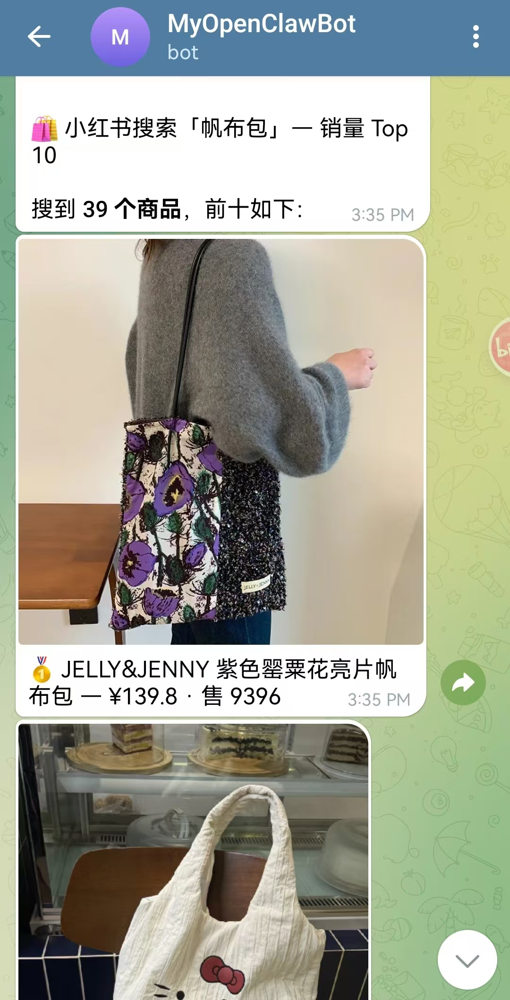
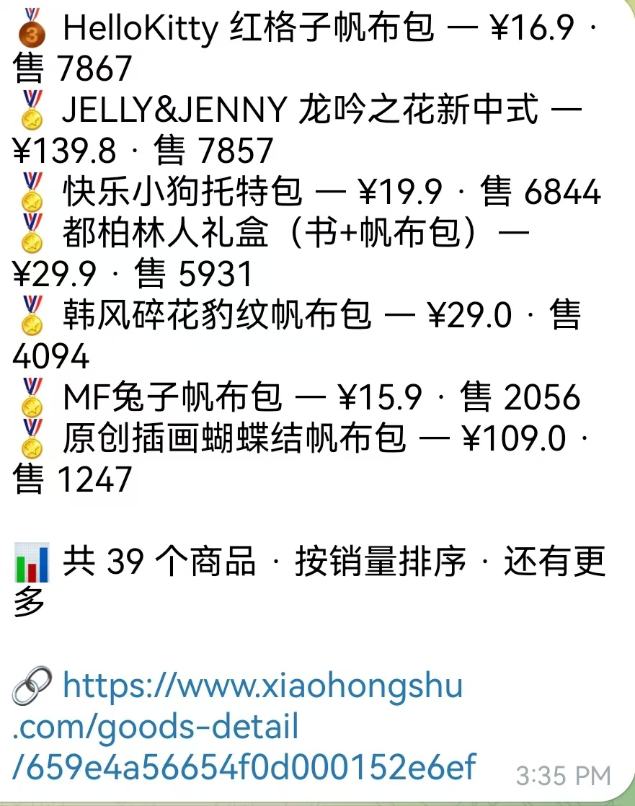

# 🛍️ xhs-scout

[简体中文](README.md) · [**English**](README_en.md)

> Chinese E-commerce Product Search MCP Server — Optimized for OpenClaw

[](#⚠️-vibecoding-disclaimer)
[](https://github.com/shopmeskills/mcp)
[](https://openclaw.ai)
[](https://github.com/shopmeskills/mcp/blob/main/LICENSE)

AI-powered search across Chinese e-commerce platforms — talk to your assistant in natural language and get real product results (images, prices, sales data, links). **No API keys required.**

> 📖 [中文说明书](../main/README.md) · This doc is for English-speaking users.

---

## 🎯 What Is This?

**xhs-scout** is an MCP (Model Context Protocol) server optimized for [OpenClaw](https://openclaw.ai), enabling AI assistants to search and query products on Chinese e-commerce platforms.

Just say *"search for canvas bags on 小红书"* — your AI does the rest.

## ✨ Features

| Tool | What It Does |
|------|-------------|
| `search_products` | Keyword search across platforms, sortable by price/sales/relevance |
| `get_product_detail` | Full product details (name, price, images, SKUs, shop info) |
| `parse_product_link` | Parse a product URL → identify platform + extract product ID |

## 📦 Platform Support

| Platform | Search | Details | Link Parsing | Notes |
|----------|:------:|:-------:|:------------:|-------|
| 🟢 小红书 (Xiaohongshu) | ✅ | ✅ | ✅ | **Stable & tested** |
| 🟡 淘宝 (Taobao) | ⚠️ | ✅ | ✅ | Spotty — works sometimes |
| 🔴 天猫 (Tmall) | ⚠️ | ✅ | ✅ | Very unstable |
| ⚫ JD.com | ❌ | ❌ | ⚠️ | Parsing only |
| ⚫ Pinduoduo | ❌ | ❌ | ⚠️ | Parsing only |
| ⚫ 1688.com | ❌ | ❌ | ⚠️ | Parsing only |
| ⚫ AliExpress | ❌ | ❌ | ⚠️ | Parsing only |
| ⚫ Douyin/TikTok Shop | ❌ | ❌ | ⚠️ | Parsing only |

> ⚠️ **Reality check**: Only **小红书 (Xiaohongshu)** has been thoroughly tested and works reliably. The MCP server claims to support 8 platforms, but in practice the upstream Shopme API only returns consistent results for XHS. Other platforms *may* return results sporadically — **treat them as experimental, not guaranteed**. Test results as of 2026-06-14.

## 📦 Source Code

> ⚠️ **This repo contains only docs, config, and install scripts — no MCP server source code.**

The MCP server core is from **[shopmeskills/mcp](https://github.com/shopmeskills/mcp)** (MIT). Install scripts pull and build from upstream automatically. This keeps the repo lightweight and avoids version drift.

To view/modify the MCP server source, visit:
👉 https://github.com/shopmeskills/mcp/tree/main/packages/cn-ecommerce-search-mcp

## 🚀 Installation

### Common Prerequisites

- [OpenClaw](https://openclaw.ai) installed
- [Node.js](https://nodejs.org) ≥ 18
- No API keys needed

---

### 🐳 Docker (recommended)

```bash
# Inside your container
docker exec -it openclaw-gateway bash

# One-liner
curl -fsSL https://raw.githubusercontent.com/WangXuexin24/xhs-scout/main/install.sh | bash
```

Or manual:

```bash
docker exec -it openclaw-gateway bash
git clone --depth=1 https://github.com/shopmeskills/mcp.git /tmp/shopme-mcp
cd /tmp/shopme-mcp
COREPACK_HOME=/tmp/corepack pnpm install --frozen-lockfile
COREPACK_HOME=/tmp/corepack pnpm run build

mkdir -p ~/.openclaw/xhs-scout
cp -r packages/cn-ecommerce-search-mcp/build ~/.openclaw/xhs-scout/build
cp packages/cn-ecommerce-search-mcp/package.json ~/.openclaw/xhs-scout/
cd ~/.openclaw/xhs-scout && npm install --omit=dev --silent

openclaw mcp set xhs-scout "{command:node,args:[$HOME/.openclaw/xhs-scout/build/index.js]}"
openclaw mcp reload
openclaw mcp probe xhs-scout  # Should show "3 tools"
```

---

### 🪟 Windows (native)

If you run OpenClaw directly on Windows (no Docker), use **PowerShell** or **CMD**:

```powershell
# 1. Ensure Node.js is installed
node --version

# 2. Clone & build (install pnpm first if needed: npm install -g pnpm)
git clone --depth=1 https://github.com/shopmeskills/mcp.git %TEMP%\shopme-mcp
cd %TEMP%\shopme-mcp
pnpm install --frozen-lockfile
pnpm run build

# 3. Copy to persistent location
mkdir %USERPROFILE%\.openclaw\xhs-scout
xcopy /E packages\cn-ecommerce-search-mcp\build %USERPROFILE%\.openclaw\xhs-scout\build\
copy packages\cn-ecommerce-search-mcp\package.json %USERPROFILE%\.openclaw\xhs-scout\
cd %USERPROFILE%\.openclaw\xhs-scout
npm install --omit=dev

# 4. Register MCP
openclaw mcp set xhs-scout "{command:node,args:[%USERPROFILE%/.openclaw/xhs-scout/build/index.js]}"
openclaw mcp reload
openclaw mcp probe xhs-scout
```

---

### 🐧 Linux / 🍎 macOS (native)

```bash
git clone --depth=1 https://github.com/shopmeskills/mcp.git /tmp/shopme-mcp
cd /tmp/shopme-mcp
export COREPACK_HOME=/tmp/corepack
pnpm install --frozen-lockfile
pnpm run build

mkdir -p $HOME/.openclaw/xhs-scout
cp -r packages/cn-ecommerce-search-mcp/build $HOME/.openclaw/xhs-scout/build
cp packages/cn-ecommerce-search-mcp/package.json $HOME/.openclaw/xhs-scout/
cd $HOME/.openclaw/xhs-scout && npm install --omit=dev --silent

openclaw mcp set xhs-scout "{command:node,args:[$HOME/.openclaw/xhs-scout/build/index.js]}"
openclaw mcp reload
openclaw mcp probe xhs-scout
```

## 💬 Usage Examples

### Search for products

```
You: Search for mechanical keyboards on Xiaohongshu

AI calls: search_products(keyword="mechanical keyboard", platform="xhs", limit=5)
→ Returns: product names, prices, sales, images, shop names
```

### Get product details

```
You: Show me details for the Jasper Chu II DSP earphones

AI calls: get_product_detail(product_id="65979cf6fe176f00011f9bd9", platform="xhs")
→ Returns: full description, SKU specs, tags, estimated weight
```

### Parse a link

```
You: What platform is this link from?

AI calls: parse_product_link(url="https://item.taobao.com/item.htm?id=...")
→ Returns: { platform: "taobao", productId: "..." }
```

### Real-world demo

```
> Searched "有线耳机" (wired earphones) on XHS
→ 17 products found
→ Top picks: MOONDROP Chu II DSP ¥129, Weijiena ¥12.2~
→ Returns product images, prices, and direct links
```

## 🔧 API Reference

### `search_products`

| Param | Type | Required | Default | Description |
|-------|------|:--------:|---------|-------------|
| `keyword` | string | ✅ | — | Search query (Chinese or English) |
| `platform` | enum | ❌ | all | `xhs` / `taobao` / `tmall` |
| `sort_by` | enum | ❌ | `relevance` | `relevance` / `price_asc` / `price_desc` / `sales_desc` |
| `page` | number | ❌ | `1` | Page number |
| `limit` | number | ❌ | `10` | Items per page (max 50) |

### `get_product_detail`

| Param | Type | Required | Description |
|-------|------|:--------:|-------------|
| `product_id` | string | either | Product ID (preferred) |
| `url` | string | either | Product URL |
| `platform` | enum | ❌ | Recommended for faster lookup |

### `parse_product_link`

| Param | Type | Required | Description |
|-------|------|:--------:|-------------|
| `url` | string | ✅ | Product URL or text containing a URL |

## 🏗️ Architecture

```
You → OpenClaw → xhs-scout (MCP Server) → Shopme API → Chinese E-Commerce Platforms
```

- **MCP Server**: [shopmeskills/mcp](https://github.com/shopmeskills/mcp) — TypeScript-based, built from source
- **Data source**: Shopme unified product database (`api.shopmeagent.com`)
- **Protocol**: Model Context Protocol (MCP) over stdio

## 🗺️ Roadmap

This is a **vibe-coded weekend project**. Future improvements welcome:

- [ ] Add more stable platform support (Taobao, JD)
- [ ] Add product comparison across platforms
- [ ] Add price history tracking
- [ ] Add CI/CD for auto-rebuild on upstream changes
- [ ] Write proper TypeScript tests

PRs welcome! 🎉

## 📸 Screenshots

### 1. Search results in Telegram



> Ask your assistant to search for products — get images, names, prices, and sales data right in chat.

### 2. Product links returned



> Full list of products with direct links to each item on the platform.

### 3. Verify on Xiaohongshu


> Click any link to open the product on Xiaohongshu — confirms the data is real.

## 👥 Who This Is For

- **AI tinkerers** who want to search Chinese e-commerce from their AI assistant
- **Cross-border shoppers** comparing prices on Chinese platforms
- **OpenClaw users** looking for a zero-config MCP server for product search
- **Vibe-coders** who want a reference for packaging MCP servers for OpenClaw

## ⚠️ Vibecoding Disclaimer

**This repository was written by an AI assistant (Clio) and has NOT undergone human code review.**

- 🧠 All code, docs, and configuration generated by AI
- 🎯 Goal: "it works" — not "it's perfect"
- ⚠️ Not production-ready. AI makes mistakes.
- 🙏 Found a bug? Open an issue or send a PR!
- 💡 If this helped you, please ⭐ Star the repo

## 🙏 Credits & Attribution

The MCP server core is from **[shopmeskills/mcp](https://github.com/shopmeskills/mcp)**, built and maintained by the Shopme team.

- Original authors: [@shopmeskills](https://github.com/shopmeskills)
- Original repository: https://github.com/shopmeskills/mcp
- Package used: `packages/cn-ecommerce-search-mcp`
- Data sourced from: Shopme API (`api.shopmeagent.com`)

**xhs-scout is a packaging and documentation layer on top of the Shopme MCP server**, making it plug-and-play for OpenClaw users. All product data copyrights belong to their respective e-commerce platforms.

## ⚖️ Legal Notice

- This tool queries the **Shopme public API** (`api.shopmeagent.com`) and does not scrape any platform directly.
- All product information displayed is publicly available data on the respective platforms.
- This repository contains no proprietary data — only configuration and documentation.
- If you are a platform representative and have concerns, please [open an issue](https://github.com/WangXuexin24/xhs-scout/issues).

## 📄 License

MIT License. See [shopmeskills/mcp](https://github.com/shopmeskills/mcp) for the original MCP server license.

---

💬 [Issues](https://github.com/WangXuexin24/xhs-scout/issues) · ⭐ [Star](https://github.com/WangXuexin24/xhs-scout)
